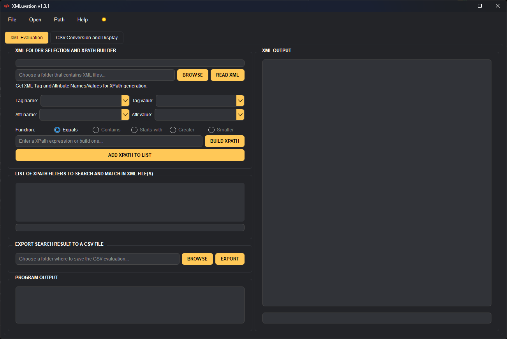
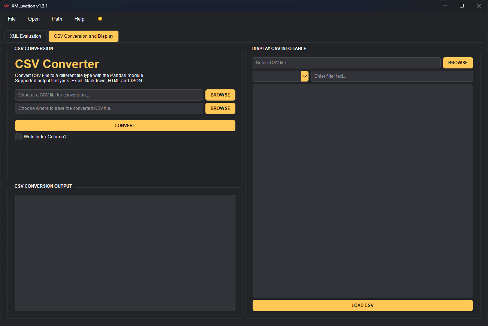

# XMLuvation - XML Evaluation Tool that searches for matches based on one or multiple XPath Expressions

 

## Overview

XMLuvation is a Python application designed to parse and evaluate XML files. It provides a user-friendly interface for performing various operations such as reading XML files, filtering XML content based on XPath Expressions and look for matches in a single or multiple XML Files in a specified Folder and exporting the evaluation results to a CSV file.

## Features

- XML Parsing and Evaluation: XMLuvation allows users to read a XML file and view it's content.
- XPath Filtering: Users can filter and look for matches in XML content using XPath expressions, which can be added to a Listbox, where the added Filters are used for Evaluation.
- Export to CSV: Evaluation results can be exported to a CSV file for further analysis or processing, headers are created dynamically based on the added XPath Expression(s).
- Convert CSV to different filetypes: The CSV Evaluation result can be converted to different filetypes with the help of the Pandas module.
- Load CSV for display and filter content: Load the CSV file into a table view to display it's content and filter results based on the selected header.

## Installation

To run XMLuvation, you need to have Python installed on your system. The required dependencies are as follows:

### Requirements

- Python 3.12.x

### Install the required dependencies via requirements.txt

`pip install -r requirements.txt`

## Main Usage Guide

1. Select Folder: Choose a folder containing XML files, the statusbar will show the total amount of found XML Files.
2. Read XML: Read an XML file from the selected folder to extract tag and attribute information into the Comboboxes.
3. Build XPath: Build XPath expressions based on selected tag and attribute values.
4. Add XPath Filter: Add XPath filters to match specific criteria in XML files.
5. Export as CSV: Export evaluation results, including matched XML files and corresponding XPath filters, as a CSV file.

## Additional Information

XPath Syntax Help: Access a quick reference guide to XPath syntax for building expressions.

## Support

If you encounter any issues or have any feedback, please feel free to open an issue on the GitHub repository.

## Credits

XMLuvation was created by me. It utilizes the PySide6 library for building the graphical user interface, the lxml library for parsing XML files and Pandas for converting the CSV file.

## License

This project is licensed under the MIT License.

## Screenshot PySide6

##### Main View

##### CSV Conversion and Table Display View

